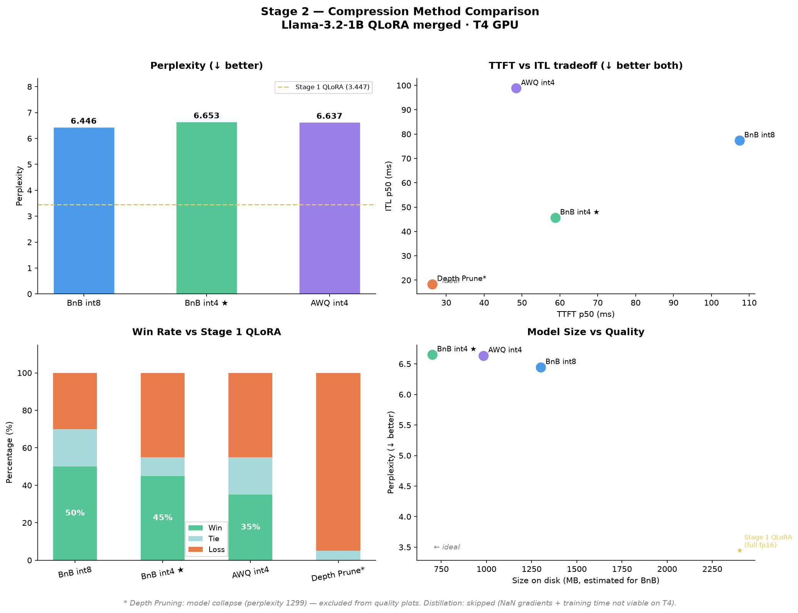

# finetune-compress-serve

End-to-end LLM lifecycle project: fine-tuning, compression, and serving —
all on free-tier Google Colab T4 GPU.

## Lifecycle

```
Base LLM (Llama-3.2-1B)
    │
    ▼
[Stage 1] Fine-Tuning 
    Full FT  │  LoRA  │  QLoRA
    │
    ▼ (winner: QLoRA)
[Stage 2] Compression 
    BnB int8  │  BnB int4  │  AWQ int4  │  Depth Pruning
    │
    ▼ (winner: BnB int4 · AWQ carried for vLLM)
[Stage 3] Serving 
    HF Transformers eager  │  SDPA  │  vLLM (AWQ)
```

## Hardware & Constraints

- **GPU**: NVIDIA T4 (Turing, compute capability 7.5) via Google Colab free tier
- **FlashAttention-2**: NOT supported on Turing — using SDPA eager / xformers instead
- **vLLM**: runs on T4 but requires `float16` and AWQ/GPTQ format (not bitsandbytes)
- **bfloat16**: not natively supported on T4 — caused library conflicts in Stage 1, NaN gradients in distillation
- **AWQ kernels**: optimized for Ampere+ — on T4, TTFT fast but ITL slower than expected (Turing fallback path)

## Environment

```bash
python >= 3.10
pip install -e .
```

## Stage 1 — Fine-Tuning Method Comparison 

| Method | Perplexity ↓ | GSM8K Acc | Win Rate | Train Time | Peak VRAM | Trainable % | Ckpt Size |
|--------|-------------|-----------|----------|------------|-----------|-------------|-----------|
| LoRA   | **3.346**   | 6%        | 72%      | 11.9 min   | 5.6 GB    | 0.14%       | ~25 MB    |
| QLoRA  | 3.447       | 4%        | 72%      | 20.2 min   | **2.3 GB**| 0.23%       | **~6 MB** |
| Full FT| NaN         | 0%        | 0%       | 37.9 min   | 11.9 GB   | 100%        | ~2.4 GB   |


**Winner: QLoRA** — quality tied with LoRA (72% win rate) at 58% less VRAM.

> **Full FT**: numerically unstable — float16 gradient overflow on T4 compounded by a bitsandbytes/accelerate version conflict that silently re-cast weights to bfloat16. Forcing bfloat16 on Turing is technically possible but training takes ~60+ min with no quality advantage over QLoRA. Full FT results excluded from comparison; treated as a hardware constraint finding.

See full analysis → [`docs/finetune.md`](docs/finetune.md)

## Stage 2 — Compression Method Comparison 

Input: QLoRA merged checkpoint from Stage 1.

| Method | Perplexity ↓ | Win Rate vs S1 | TTFT p50 | ITL p50 | Throughput | Size (MB) |
|--------|-------------|---------------|----------|---------|------------|-----------|
| BnB int8 | **6.446** | **50%** | 107.4 ms | 77.3 ms | 12.9 tok/s | ~1300* |
| BnB int4 ★ | 6.653 | 45% | 58.8 ms | **45.7 ms** | **21.9 tok/s** | ~700* |
| AWQ int4 | 6.637 | 35% | **48.5 ms** | 98.8 ms | 10.1 tok/s | **983** |
| Depth Prune | 1299.8    | 0% | 26.3 ms | 18.4 ms | 54.4 tok/s | 1893 |
| Distillation | skipped† | — | — | — | — | — |



**Winner: BnB int4** — 2x throughput vs int8 with marginal quality delta. AWQ carried to Stage 3 as the only vLLM-compatible format.

> *BnB quantization is load-time only — no separate checkpoint saved. Size is theoretical estimate.
> **Depth Pruning**: model collapse (perplexity 1299). Magnitude scoring too naive — removed early layers (1,2,5,6) critical for token representation. Throughput 54 tok/s shows the theoretical upside but quality not viable.
> **Distillation**: skipped due to NaN gradients (float16 instability on T4) and estimated 30–60 min training time. Viable on A100/H100 with bfloat16. See [`docs/compress.md`](docs/compress.md) for full note.

See full analysis → [`docs/compress.md`](docs/compress.md)

## Stage 3 — Serving Engine Comparison 

> ⏳ In progress — inputs: BnB int4 (HF transformers) + AWQ int4 (vLLM)

| Engine | TTFT p50 | ITL p50 | ITL p99 | Throughput | Peak Memory | Attention Backend |
|--------|----------|---------|---------|------------|-------------|-------------------|
| HF generate() eager | - | - | - | - | - | eager |
| HF generate() SDPA | - | - | - | - | - | SDPA |
| vLLM (AWQ) | - | - | - | - | - | - |

**Winner**: TBD

See full analysis → [`docs/serve.md`](docs/serve.md)

## Key Findings

### Stage 1
- **QLoRA matches LoRA quality at 58% less VRAM** — 2.3 GB vs 5.6 GB, same 72% win rate
- **Win rate > perplexity as quality signal** for instruction tuning — perplexity gap (0.101) doesn't translate to perceivable difference
- **GSM8K low by design** — Alpaca trains instruction-following, not math reasoning; distribution mismatch not forgetting
- **T4 dtype conflicts are a real engineering problem** — float16/bfloat16 version conflicts across transformers/accelerate/bitsandbytes; not documented in tutorials that assume Ampere+

### Stage 2
- **int4 is the practical sweet spot** — 2x throughput vs int8 with marginal quality loss
- **AWQ kernel performance is architecture-dependent** — fast TTFT but slow ITL on T4 (Turing fallback); same checkpoint on A100 would perform significantly better
- **bitsandbytes and vLLM are incompatible** — compression format determines serving options; a real MLOps friction point worth documenting
- **Magnitude depth pruning unreliable without layer protection** — score range too narrow, early layers removed causing collapse
- **Peak inference memory dominated by activations not weights** — int8 vs int4 peak mem gap smaller than expected (539 vs 502 MB)

## Limitations

- T4 (sm_75): no FA2, no native bfloat16, AWQ kernel degradation, VRAM-constrained
- Distillation not viable on T4 at this scale without bfloat16
- Pruning without post-prune fine-tuning causes collapse at 25% depth removal
- What changes on A100/H100: native bfloat16, FA2, AWQ optimal kernels, distillation feasible
