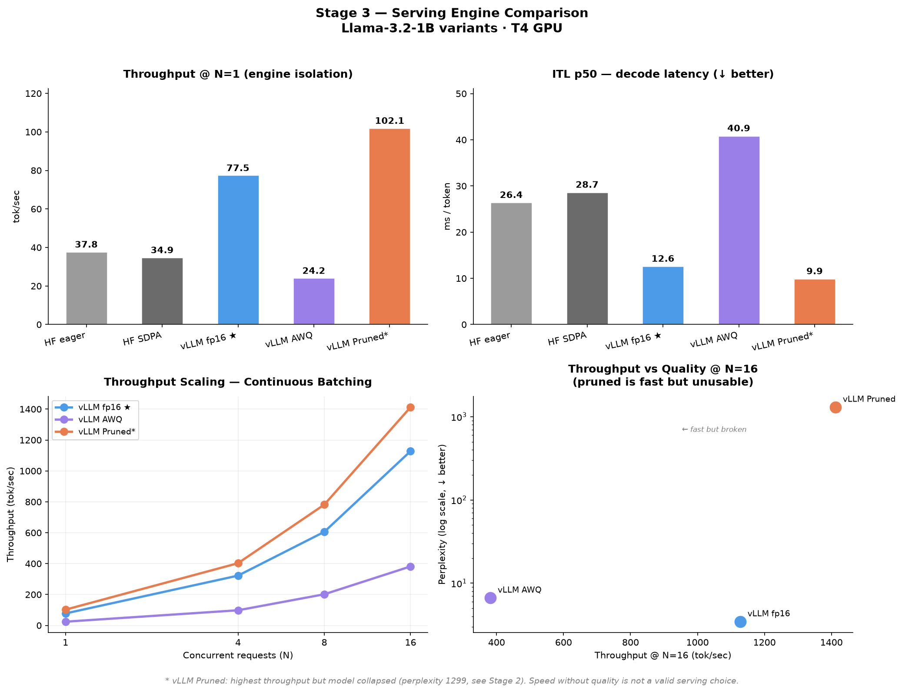

# finetune-compress-serve

End-to-end LLM lifecycle project: fine-tuning, compression, and serving —
all on free-tier Google Colab T4 GPU.

## Lifecycle

```
Base LLM (Llama-3.2-1B)
    │
    ▼
[Stage 1] Fine-Tuning 
    Full FT  │  LoRA  │  QLoRA
    │
    ▼ (winner: QLoRA)
[Stage 2] Compression 
    BnB int8  │  BnB int4  │  AWQ int4  │  Depth Pruning
    │
    ▼ (winner: BnB int4 · AWQ + fp16 carried to Stage 3)
[Stage 3] Serving 
    HF eager  │  HF SDPA  │  vLLM fp16  │  vLLM AWQ  │  vLLM Pruned
    │
    ▼
    Final winner: vLLM fp16 (no compression needed)
```

## Hardware & Constraints

- **GPU**: NVIDIA T4 (Turing, compute capability 7.5) via Google Colab free tier
- **FlashAttention-2**: NOT supported on Turing — verified vLLM falls back to XFormers backend
- **vLLM**: runs on T4 but requires `float16` and AWQ/GPTQ format (not bitsandbytes)
- **bfloat16**: not natively supported on T4 — caused library conflicts in Stage 1, NaN gradients in distillation
- **AWQ kernels**: optimized for Ampere+ — on T4, even via vLLM's proper kernel, ITL remains 3.2x slower than fp16

## Environment

```bash
python >= 3.10
pip install -e .
```

## Stage 1 — Fine-Tuning Method Comparison 

| Method | Perplexity ↓ | GSM8K Acc | Win Rate | Train Time | Peak VRAM | Trainable % | Ckpt Size |
|--------|-------------|-----------|----------|------------|-----------|-------------|-----------|
| LoRA   | **3.346**   | 6%        | 72%      | 11.9 min   | 5.6 GB    | 0.14%       | ~25 MB    |
| QLoRA  | 3.447       | 4%        | 72%      | 20.2 min   | **2.3 GB**| 0.23%       | **~6 MB** |
| Full FT| NaN       | 0%        | 0%       | 37.9 min   | 11.9 GB   | 100%        | ~2.4 GB   |


**Winner: QLoRA** — quality tied with LoRA (72% win rate) at 58% less VRAM.

> **Full FT**: numerically unstable — float16 gradient overflow on T4 compounded by a bitsandbytes/accelerate version conflict that silently re-cast weights to bfloat16. Forcing bfloat16 on Turing is technically possible but training takes ~60+ min with no quality advantage over QLoRA.

See full analysis → [`docs/finetune.md`](docs/finetune.md)

## Stage 2 — Compression Method Comparison ✅

Input: QLoRA merged checkpoint from Stage 1.

| Method | Perplexity ↓ | Win Rate vs S1 | TTFT p50 | ITL p50 | Throughput | Size (MB) |
|--------|-------------|---------------|----------|---------|------------|-----------|
| BnB int8 | **6.446** | **50%** | 107.4 ms | 77.3 ms | 12.9 tok/s | ~1300* |
| BnB int4 ★ | 6.653 | 45% | 58.8 ms | **45.7 ms** | **21.9 tok/s** | ~700* |
| AWQ int4 | 6.637 | 35% | **48.5 ms** | 98.8 ms | 10.1 tok/s | **983** |
| Depth Prune | 1299.8 | 0% | 26.3 ms | 18.4 ms | 54.4 tok/s | 1893 |
| Distillation | skipped† | — | — | — | — | — |


**Winner: BnB int4** — 2x throughput vs int8 with marginal quality delta. AWQ + fp16 carried to Stage 3 for serving comparison.

> *BnB quantization is load-time only — no separate checkpoint saved. Size is theoretical estimate.
> **Depth Pruning**: model collapse (perplexity 1299). Magnitude scoring too naive — removed early layers critical for token representation.
> † **Distillation**: skipped due to NaN gradients (float16 instability on T4). Viable on A100/H100 with bfloat16.

See full analysis → [`docs/compress.md`](docs/compress.md)

## Stage 3 — Serving Engine Comparison 

Hypothesis-driven design: isolate serving engine effect, test if vLLM's proper AWQ kernel fixes Stage 2's ITL regression, and check if pruning's throughput advantage holds under continuous batching.

| Engine | Model | ITL p50 (N=1) | Throughput @N=1 | Throughput @N=16 |
|--------|-------|---------------|-------------------|---------------------|
| HF eager | fp16 | 26.4 ms | 37.8 tok/s | — (no batching) |
| HF SDPA | fp16 | 28.7 ms | 34.9 tok/s | — (no batching) |
| vLLM fp16 ★ | fp16 | **12.6 ms** | **77.5 tok/s** | **1127.8 tok/s** |
| vLLM AWQ | int4 | 40.9 ms | 24.2 tok/s | 381.8 tok/s |
| vLLM Pruned | fp16 (collapsed) | 9.9 ms | 102.1 tok/s | 1412.2 tok/s |



**Winner: vLLM fp16** — best throughput at full quality, no compression complexity needed. The serving engine alone (PagedAttention + continuous batching) delivers 2.05x throughput over HF eager with zero quality cost.

> **vLLM Pruned**: fastest in raw throughput (1412 tok/s @ N=16) but model is non-functional (perplexity 1299, see Stage 2). Throughput numbers are meaningless without quality context — this result is the clearest demonstration of that principle in the project.
> **AWQ hypothesis**: vLLM's proper GEMM kernel reduced ITL from 98.8ms (HF naive) to 40.9ms — confirming HF's naive loading caused most of Stage 2's regression. But a 3.2x gap vs fp16 remains, attributable to AWQ kernels being optimized for Ampere+, not Turing.
> **Measurement limitation**: vLLM peak memory reads as 0.0 — vLLM manages its own GPU memory pool outside PyTorch's allocator; this is a tooling gap, not zero actual usage.

See full analysis → [`docs/serve.md`](docs/serve.md)

## Key Findings

### Stage 1
- **QLoRA matches LoRA quality at 58% less VRAM** — 2.3 GB vs 5.6 GB, same 72% win rate
- **Win rate > perplexity as quality signal** for instruction tuning
- **GSM8K low by design** — Alpaca trains instruction-following, not math reasoning
- **T4 dtype conflicts are a real engineering problem** — float16/bfloat16 version conflicts across transformers/accelerate/bitsandbytes

### Stage 2
- **int4 is the practical sweet spot** — 2x throughput vs int8 with marginal quality loss
- **AWQ kernel performance is architecture-dependent** — fast TTFT but slow ITL on T4 (Turing fallback)
- **bitsandbytes and vLLM are incompatible** — compression format determines serving options downstream
- **Magnitude depth pruning unreliable without layer protection** — early layers removed, model collapsed

### Stage 3
- **Serving engine choice matters as much as compression** — vLLM fp16 alone beats every HF config by 2x+, zero quality cost
- **Optimized kernels explain most of the AWQ regression, not the format itself** — vLLM's proper kernel cut ITL by 60% vs HF naive loading; remaining 3.2x gap is genuine Turing/Ampere+ architecture mismatch
- **Continuous batching scales throughput proportionally, not correctively** — AWQ's inefficiency persists at every concurrency level (N=1 to N=16), batching multiplies whatever efficiency you start with
- **Throughput must never be reported without quality** — the pruned model is the fastest config in the entire project (1412 tok/s) and the most broken (perplexity 1299)
- **Backend assumptions should be verified** — HF SDPA underperformed eager attention on T4 at small batch sizes, a counter-intuitive result that would've gone unnoticed without direct benchmarking

## Final Recommendation

For T4-class hardware with this model and workload: **use vLLM with the fp16 merged checkpoint.** It delivers the best throughput-quality combination with zero compression complexity or format conversion risk. Compression (int4/AWQ) becomes worthwhile specifically when VRAM capacity — not throughput — is the binding constraint.

## Limitations

- T4 (sm_75): no FA2, no native bfloat16, AWQ kernel degradation, VRAM-constrained
- Distillation not viable on T4 at this scale without bfloat16
- Pruning without post-prune fine-tuning causes collapse at 25% depth removal
- vLLM memory measurement requires `nvidia-smi` polling, not `torch.cuda` APIs
- What changes on A100/H100: native bfloat16, FA2, AWQ near-parity with fp16, distillation feasible, full FT viable
