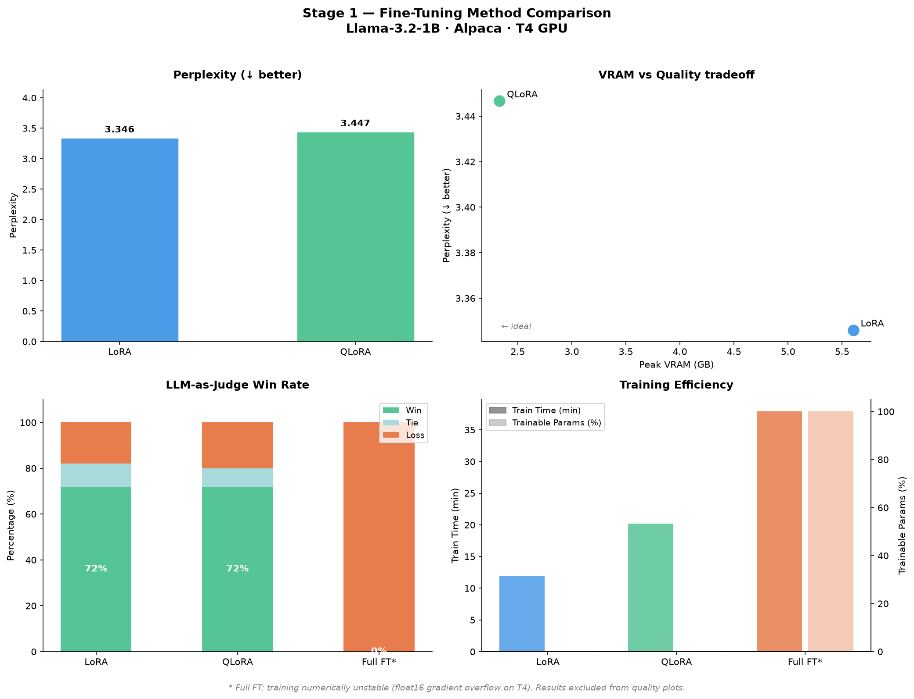

# finetune-compress-serve

End-to-end LLM lifecycle project: fine-tuning, compression, and serving —
all on free-tier Google Colab T4 GPU.

## Lifecycle

```
Base LLM (Llama-3.2-1B)
    │
    ▼
[Stage 1] Fine-Tuning 
    Full FT  │  LoRA  │  QLoRA
    │
    ▼ (winner: QLoRA)
[Stage 2] Compression 
    Quantization  │  Pruning  │  Distillation
    │
    ▼ (best method)
[Stage 3] Serving 
    HF Transformers  │  SDPA/xformers  │  vLLM
```

## Hardware & Constraints

- **GPU**: NVIDIA T4 (Turing, compute capability 7.5) via Google Colab free tier
- **FlashAttention-2**: NOT supported on Turing — using SDPA eager / xformers instead
- **vLLM**: runs on T4 but requires `float16` (not `bfloat16`, needs sm_80+)
- **bfloat16**: not natively supported on T4 — caused significant library version conflicts during Stage 1 (see [`docs/finetune.md`](docs/finetune.md))
- **Quantization format**: `bitsandbytes` int4/int8 from training is NOT directly compatible with vLLM's AWQ/GPTQ — re-quantization step required before Stage 3

## Environment

```bash
python >= 3.10
pip install -e .
```

## Stage 1 — Fine-Tuning Method Comparison 

| Method | Perplexity ↓ | GSM8K Acc | Win Rate | Train Time | Peak VRAM | Trainable % | Ckpt Size |
|--------|-------------|-----------|----------|------------|-----------|-------------|-----------|
| LoRA   | **3.346**   | 6%        | 72%      | 11.9 min   | 5.6 GB    | 0.14%       | ~25 MB    |
| QLoRA  | 3.447       | 4%        | 72%      | **20.2 min**| **2.3 GB**| 0.23%      | **~6 MB** |
| Full FT| NaN         | 0%        | 0%       | 37.9 min   | 11.9 GB   | 100%        | ~2.4 GB   |



**Winner: QLoRA** — quality nearly identical to LoRA (win rate tied at 72%) at 58% less VRAM (2.3 GB vs 5.6 GB). On T4, this is the clear practical choice.

> **Full FT note**: Training was numerically unstable due to float16 gradient overflow/underflow on T4. A version conflict between `transformers`, `accelerate`, and `bitsandbytes` caused silent re-casting to bfloat16 (not natively supported on Turing), making training either unstable (float16) or extremely slow (~60+ min, bfloat16). Full FT results are excluded from quality comparison and treated as a hardware constraint finding. This would be fully viable on A100/H100 with native bfloat16 support.

See full analysis → [`docs/finetune.md`](docs/finetune.md)

## Stage 2 — Compression Method Comparison 

> Pending — input: QLoRA merged checkpoint from Stage 1

| Method | Perplexity | Size on Disk | Inference Memory | Latency | Quality Δ |
|--------|------------|--------------|-----------------|---------|-----------|
| Quantization (int8) | - | - | - | - | - |
| Quantization (int4) | - | - | - | - | - |
| Pruning | - | - | - | - | - |
| Distillation | - | - | - | - | - |

**Winner**: TBD

See full analysis → [`docs/compress.md`](docs/compress.md)

## Stage 3 — Serving Engine Comparison 

> Pending Stage 2

| Engine | TTFT p50 | ITL p50 | ITL p99 | Throughput | Peak Memory | Attention Backend |
|--------|----------|---------|---------|------------|-------------|-------------------|
| HF generate() eager | - | - | - | - | - | - |
| HF generate() SDPA | - | - | - | - | - | - |
| vLLM | - | - | - | - | - | - |

**Winner**: TBD

See full analysis → [`docs/serve.md`](docs/serve.md)

## Key Findings

### Stage 1
- **QLoRA matches LoRA quality at 58% less VRAM** — 2.3 GB vs 5.6 GB peak, same 72% win rate
- **Win rate > perplexity as quality signal** — both methods win 72% vs base model; perplexity gap (0.101) doesn't translate to perceivable difference
- **GSM8K accuracy low by design** — Alpaca trains instruction-following, not math reasoning; low GSM8K is a distribution mismatch, not forgetting
- **T4 dtype conflicts are a real engineering problem** — float16/bfloat16 library version conflicts across `transformers`/`accelerate`/`bitsandbytes` cost significant debugging; not documented in most tutorials that assume Ampere+

## Limitations

- T4 (sm_7.5) limits: no FlashAttention-2, no native bfloat16, constrained VRAM
- Full FT not viable on T4 at float16 without significant loss scaling engineering
- What would change on A100/H100: native bfloat16, FA2, larger batch sizes, full FT feasible
